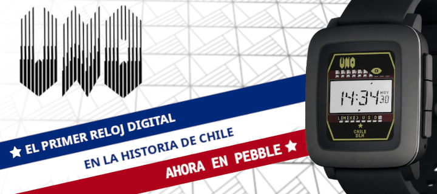

# El número UNO — Watchface para Pebble

Réplica digital del reloj UNO, el primer reloj digital fabricado en Chile. Disponible para Pebble Time 2 (emery), Pebble Time (basalt) y Pebble Classic (aplite).

---

## Plataformas

| Plataforma | Modelo | Pantalla | Color |
|---|---|---|---|
| **emery** | Pebble Time 2 | 200×228 | 64 colores |
| **basalt** | Pebble Time | 144×168 | 64 colores |
| **aplite** | Pebble Classic | 144×168 | Blanco y negro |

---

## Features

### Esfera
- Diseño fiel al reloj UNO original: cuerpo octogonal dorado, dial hexagonal blanco
- Logo UNO y ojo de cristal renderizados como imagen PNG con canal alfa
- Borde amarillo octogonal
- Estrella chilena con texto "CHILE / DLH" en la parte inferior

### Hora y fecha
- Hora en fuente digits.ttf personalizada (tamaño grande)
- Soporte para formato 12h y 24h (con indicador M/T en modo 12h)
- Día del mes en esquina derecha del dial
- Indicador del día de la semana (LU–DO en emery, L–D en basalt/aplite) con triángulo marcador del día actual

### Indicador HOY / Modo 18
- Al agitar el reloj se activa el **modo 18**: muestra los días restantes para el 18 de septiembre
- El indicador "HOY" parpadea durante el countdown
- El modo se cierra automáticamente a los 4 segundos

### Indicador de batería (cuarzo)
- Imagen del cristal de cuarzo posicionada sobre el ojo de BT
- Un bloque de color cubre progresivamente la imagen de derecha a izquierda según el nivel de batería
- Batería 100% → imagen completa visible; batería 1% → solo 10px visibles
- Se actualiza automáticamente al cambiar el nivel de batería
- Disponible en emery, basalt y aplite (con imagen adaptada a cada plataforma)

### Bluetooth
- Triángulo de alarma visible cuando hay conexión Bluetooth activa

### Configuración (Clay)
Accesible desde la app Pebble en el teléfono:

| Opción | Descripción | Plataformas |
|---|---|---|
| Mensaje de bienvenida | Activa el scroll al iniciar | Todas |
| Porción transparente | Usa el fondo original del reloj | Emery, Basalt |
| Color de fondo | Selector de color para el cuerpo | Emery, Basalt |
| Diseño de pantalla | Dial hexagonal o rectangular | Emery, Basalt |

---

## En desarrollo

### Modo Sonidos
El watchface incluye un sistema de reproducción de audio y animación sincronizada:

- **Canciones disponibles:**
  - `01` — Bip Dieciochero (melodía simple)
  - `03` — Himno Nacional de Chile
- **Scroll sincronizado:** el mensaje "DANDO LA HORA - HECHO EN CHILE - " se desplaza en la esfera letra por letra al ritmo de las notas musicales
- **Número de canción** visible en el lugar del día durante la reproducción
- La lógica está completamente implementada y funcional

**Pendiente:** el modo sonidos requiere pantalla táctil (Pebble Time 2) para activarse mediante una pulsación larga sobre el ojo de cristal. El emulador QEMU no soporta eventos táctiles, por lo que no es posible probar esta funcionalidad sin el hardware real. La activación desde la app del teléfono o mediante un gesto alternativo está pendiente de implementación.

---

## Estructura del proyecto

```
src/c/
├── main.c        — Ventana principal, capas, configuración, servicios
├── dieciocho.c/h — Modo countdown 18 de septiembre
└── sonidos.c/h   — Scroll de bienvenida, reproducción de audio, indicador de batería cuarzo

resources/
├── fonts/        — digits.ttf (fuente personalizada)
├── images/       — PNG del reloj (ojo, cuarzo, cara interior, logo UNO)
└── songs/        — Canciones en texto plano (nota midi, duración, velocidad)

scripts/
├── emu.sh        — Lanzador del emulador con limpieza de estado huérfano
└── clay-config.html — Página de configuración standalone
```

---

## Instalación

### Emulador
```bash
./scripts/emu.sh install emery     # Pebble Time 2
./scripts/emu.sh install basalt    # Pebble Time
./scripts/emu.sh install aplite    # Pebble Classic
```

Con logs:
```bash
./scripts/emu.sh logs emery
```

Con configuración:
```bash
./scripts/emu.sh config emery
```

### Hardware real
```bash
pebble build
pebble install --phone <ip-del-telefono>
```

---

## Créditos

Desarrollado por Pablo Godoy — réplica del reloj UNO, primer reloj digital fabricado en Chile.

### Diseño de segmentos
Los segmentos del display digital están basados en el trabajo de **Michiel de Boer**, compilado en su referencia de diseños de segmentos:
[All segment designs v1.1](https://www.michieldb.nl/other/segments/All%20segment%20designs%20v1-1.svg)

Este recurso fue mencionado en el canal de YouTube **[POSY](https://www.youtube.com/@PosyMusic)** del mismo autor.
